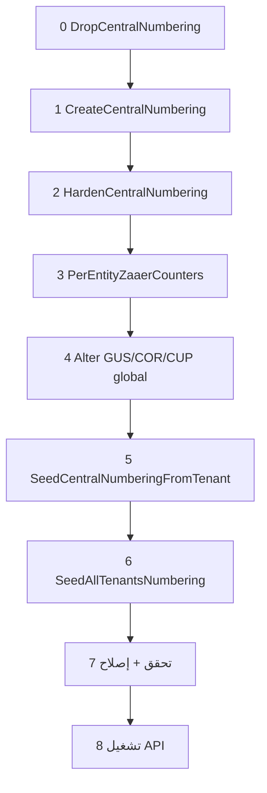

# خريطة الترقيم المركزي — من الصفر إلى الإنتاج

> **أين تُنفَّذ السكربتات:** قاعدة **Master** فقط، ما عدا ما هو مُعلَّم «tenant DB».  
> **ديناميكي:** `SeedAllTenantsNumbering.sql` يقرأ كل صفوف `dbo.Tenants` تلقائياً — لا تعديل يدوي عند إضافة فندق.

---

## قبل البدء

| # | ماذا |
|---|------|
| 1 | نسخة احتياطية لـ **Master DB** |
| 2 | إيقاف **API** / workers التي تستدعي `GetNextBusinessIdentity` أو `GetNextEntityZaaerId` |
| 3 | التأكد أن `dbo.Tenants` فيها `DatabaseName` و`ZaaerId` صحيحان لكل فندق |

---

## المرحلة 0 — حذف كامل (إعادة من الصفر فقط)

| # | السكربت | الوصف |
|---|---------|--------|
| **0** | [DropCentralNumbering.sql](./DropCentralNumbering.sql) | يحذف الجداول والإجراءات والـ sequence القديم |

**نتيجة متوقعة:** `OK — central numbering objects removed` واستعلام التحقق في آخر الملف **فارغ**.

> **تحديث بدون حذف:** تخطَّى المرحلة 0 ونفّذ من المرحلة 1 فقط ما لم يُنفَّذ سابقاً، ثم أعد الـ seed (المرحلة 6).

---

## المرحلة 1–6 — البناء والـ seed (بالترتيب الإلزامي)

| # | السكربت | أين | ماذا يفعل |
|---|---------|-----|-----------|
| **1** | [CreateCentralNumbering.sql](./CreateCentralNumbering.sql) | Master | `DocumentTypes`, `DocumentCounters`, `NumberGenerationAudit`, إجراءات أساسية |
| **2** | [HardenCentralNumbering.sql](./HardenCentralNumbering.sql) | Master | Idempotency (`request_ref`) + تحديث الإجراءات |
| **3** | [PerEntityZaaerCounters.sql](./PerEntityZaaerCounters.sql) | Master | `EntityZaaerCounters` + `zaaer_id` لكل نوع كيان (Plan B) |
| **4** | [AlterCentralNumberingGlobalCustomerCorporateCoupon.sql](./AlterCentralNumberingGlobalCustomerCorporateCoupon.sql) | Master | **GUS / COR / CUP عالمي** (`hotel_zaaer_id = 0`) — **قبل الـ seed** |
| **5** | [SeedCentralNumberingFromTenant.sql](./SeedCentralNumberingFromTenant.sql) | Master | ينشئ إجراء `SeedCentralNumberingForTenant` فقط (لا بيانات) |
| **6** | [SeedAllTenantsNumbering.sql](./SeedAllTenantsNumbering.sql) | Master | يمر على **كل** `Tenants.DatabaseName` ويملأ العدادات من بيانات كل tenant |



---

## المرحلة 7 — اختياري (tenant DB + فندق واحد)

| # | السكربت | أين | متى |
|---|---------|-----|-----|
| **7a** | [CreateBookingEngineCouponsAndPromo.sql](./CreateBookingEngineCouponsAndPromo.sql) | **كل tenant DB** يستخدم كوبونات الحجز | قبل أو مع الـ seed حتى يُقرأ `MAX(coupon_no)` لـ CUP |
| **7b** | — | Master | seed **فندق واحد** يدوياً (اختبار أو فندق ناقص): |

```sql
EXEC dbo.SeedCentralNumberingForTenant
    @TenantId = 94,              -- من dbo.Tenants.Id
    @TenantDatabase = N'db54745_Hail1';  -- من dbo.Tenants.DatabaseName
```

| **7c** | [EnsureDocumentCountersForHotel.sql](./EnsureDocumentCountersForHotel.sql) | Master | صفوف `DocumentCounters` ناقصة لفندق **بدون** إعادة MAX كامل |

---

## المرحلة 8 — تحقق وإصلاح (Master)

### 8.1 تحقق ديناميكي

```sql
-- A) tenants مسجّلون بدون عداد REV
SELECT t.Id, t.Code, t.ZaaerId, t.DatabaseName
FROM dbo.Tenants AS t
WHERE NULLIF(LTRIM(RTRIM(t.DatabaseName)), N'') IS NOT NULL
  AND t.ZaaerId IS NOT NULL AND t.ZaaerId > 0
  AND NOT EXISTS (
      SELECT 1 FROM dbo.DocumentCounters AS c
      WHERE c.doc_code = N'reservation' AND c.hotel_zaaer_id = t.ZaaerId
  )
ORDER BY t.Id;

-- B) GUS/COR/CUP: صف واحد لكل نوع على hotel_zaaer_id = 0
SELECT doc_code, COUNT(*) AS cnt, MAX(current_value) AS max_val
FROM dbo.DocumentCounters
WHERE doc_code IN (N'customer', N'corporate', N'booking_coupon')
GROUP BY doc_code;

-- C) صفوف GUS خاطئة per-hotel (يجب 0)
SELECT * FROM dbo.DocumentCounters
WHERE doc_code IN (N'customer', N'corporate', N'booking_coupon')
  AND hotel_zaaer_id <> 0;
```

**نجاح:** (A) فارغ، (B) 3 صفوف كلها `hotel_zaaer_id = 0`، (C) فارغ.

### 8.2 إصلاح GUS/COR/CUP إن وُجدت صفوف per-hotel

```sql
DECLARE @MaxGus BIGINT = (SELECT MAX(current_value) FROM dbo.DocumentCounters WHERE doc_code = N'customer');
EXEC dbo.SeedDocumentCounter @HotelZaaerId = 0, @DocCode = N'customer', @CurrentValue = @MaxGus;

DELETE FROM dbo.DocumentCounters
WHERE doc_code IN (N'customer', N'corporate', N'booking_coupon')
  AND hotel_zaaer_id <> 0;
```

لكل tenant ظهر في (A): نفّذ **7b** ثم أعد (8.1).

---

## المرحلة 9 — تشغيل التطبيق

1. Deploy / تشغيل API الذي يستخدم `NumberingService` → `GetNextBusinessIdentity`.
2. لا تُدخل `customer_no` / `zaaer_id` يدوياً في tenant إلا للقراءة/ترحيل استثنائي.

---

## فندق جديد لاحقاً (بدون إعادة Drop)

| # | الإجراء |
|---|---------|
| 1 | أضف صفاً في `dbo.Tenants` (`DatabaseName`, `ZaaerId`, …) |
| 2 | أنشئ tenant DB (إن لزم) + سكربتات الجداول العادية |
| 3 | [CreateBookingEngineCouponsAndPromo.sql](./CreateBookingEngineCouponsAndPromo.sql) على tenant DB إن احتجت CUP |
| 4 | `EXEC dbo.SeedCentralNumberingForTenant @TenantId=…, @TenantDatabase=…` **أو** أعد [SeedAllTenantsNumbering.sql](./SeedAllTenantsNumbering.sql) |
| 5 | مرحلة **8** تحقق |

---

## ملفات مرجعية (قراءة فقط)

| الملف | الغرض |
|-------|--------|
| [NUMBERING_SEED_SSMS_GUIDE.sql](./NUMBERING_SEED_SSMS_GUIDE.sql) | فحوصات SSMS + جدول «من أين يُقرأ MAX» |
| [../docs/NUMBERING_AND_ZAAER_ID.md](../docs/NUMBERING_AND_ZAAER_ID.md) | شرح معماري: `document_no` vs `zaaer_id` |

---

## ملخص الملفات بالترتيب (نسخ سريع)

```
0  DropCentralNumbering.sql
1  CreateCentralNumbering.sql
2  HardenCentralNumbering.sql
3  PerEntityZaaerCounters.sql
4  AlterCentralNumberingGlobalCustomerCorporateCoupon.sql   ← قبل seed
5  SeedCentralNumberingFromTenant.sql
6  SeedAllTenantsNumbering.sql
7a CreateBookingEngineCouponsAndPromo.sql  (كل tenant DB — اختياري)
7b SeedCentralNumberingForTenant         (فندق ناقص — عند الحاجة)
7c EnsureDocumentCountersForHotel.sql    (اختياري)
8  تحقق + إصلاح SQL أعلاه
9  تشغيل API
```
