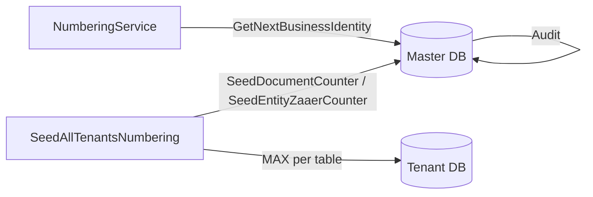

# Numbering and Zaaer integration IDs

مرجع تشغيلي لـ **Master DB** + `NumberingService` في الـ API.

---

## 1) الفكرة في سطرين

| الرقم | الغرض | أين يُخزَّن | النطاق |
|-------|--------|-------------|--------|
| **`document_no`** | رقم يظهر للموظف (REV, GUS, INVO…) | عمود في جدول الـ tenant + عداد `DocumentCounters` | **لكل فندق** + `doc_code` |
| **`zaaer_id`** | معرّف تكامل / sync | عمود `zaaer_id` في جدول الـ tenant + عداد `EntityZaaerCounters` | **عالمي لكل نوع كيان** عبر كل قواعد البيانات |

**قاعدة التفرد:** `(entity_type, zaaer_id)` — وليس `zaaer_id` وحده.

---

## 2) قاعدة البيانات: Master DB فقط

كل الجداول والإجراءات التالية على **Master** (ليست على tenant DB).

### جداول

| الجدول | الدور |
|--------|------|
| **`dbo.DocumentTypes`** | تعريف أنواع المستندات: `doc_code`, `prefix`, `padding`, `separator`, `uses_global_zaaer_id`, `zaaer_entity_code` |
| **`dbo.DocumentCounters`** | آخر قيمة رقم عرض **`document_no`** لكل `(hotel_zaaer_id, doc_code)` |
| **`dbo.EntityZaaerCounters`** | آخر قيمة **`zaaer_id`** لكل `entity_code` (Plan B) |
| **`dbo.NumberGenerationAudit`** | سجل حجز/تأكيد/إلغاء الأرقام + `request_ref` للـ idempotency |
| **`dbo.GlobalZaaerSeq`** | *(قديم)* sequence موحّد — **لا يُستخدم** بعد `PerEntityZaaerCounters.sql` |

أعمدة مهمة في `DocumentTypes`:

- **`uses_global_zaaer_id`**: إذا `1` يُخصَّص `zaaer_id` من `EntityZaaerCounters` عند `GetNextBusinessIdentity`.
- **`zaaer_entity_code`**: اختياري — مثال: `payment_refund` → يشارك عداد `payment_receipt`.

### إجراءات يستدعيها `NumberingService` (C#)

| إجراء Master | استدعاء C# | المخرجات |
|--------------|------------|----------|
| **`dbo.GetNextEntityZaaerId`** | `GetNextEntityZaaerIdAsync(docCode, …)` | `ZaaerId`, `AuditId` |
| **`dbo.GetNextDocumentNumber`** | `GetNextDocumentNumberAsync(docCode, hotelId, …)` | `NumericValue`, `DocumentNo`, `AuditId` |
| **`dbo.GetNextBusinessIdentity`** | `GetNextBusinessIdentityAsync(docCode, hotelId, …)` | `ZaaerId`, `NumericValue`, `DocumentNo`, `AuditId` |
| **`dbo.MarkNumberGenerationCommitted`** | `MarkCommittedAsync(auditId)` | — |
| **`dbo.MarkNumberGenerationVoided`** | `MarkVoidedAsync(auditId, reason)` | — |

**ملاحظة:** `hotelId` في C# = `hotel_settings.hotel_id` (محلي). الـ SP يستقبل `Tenants.ZaaerId` كـ `@HotelZaaerId` عبر `ITenantService`.

### إجراءات داخلية / seed (لا يستدعيها C# مباشرة)

| إجراء | الدور |
|-------|------|
| **`dbo.AllocateEntityZaaerIdFromDocCode`** | زيادة `EntityZaaerCounters` + إرجاع `zaaer_id` |
| **`dbo.GetNextGlobalZaaerId`** | غلاف قديم → يوجّه إلى `GetNextEntityZaaerId` (يتطلب `@DocCode`) |
| **`dbo.SeedDocumentCounter`** | ضبط/رفع `DocumentCounters.current_value` |
| **`dbo.SeedEntityZaaerCounter`** | ضبط/رفع `EntityZaaerCounters.current_value` |
| **`dbo.SeedCentralNumberingForTenant`** | قراءة MAX من **tenant DB واحد** وتحديث العدادات في Master |

### ثوابت C# (`NumberingDocCodes`)

`customer`, `corporate`, `reservation`, `payment_receipt`, `payment_refund`, `invoice`, `order`, `credit_note`, `debit_note`, `promissory_note`, `expense`, `building`, `floor`, `apartment`, `room_type`, `facility`.

---

## 3) تعريف `DocumentTypes` (بعد PerEntityZaaerCounters)

| doc_code | prefix عرض | zaaer_entity_code | ملاحظة |
|----------|------------|-------------------|--------|
| customer | GUS | — | |
| corporate | COR | — | |
| reservation | REV | — | |
| payment_receipt | REC | — | |
| payment_refund | PAY | payment_receipt | نفس جدول السندات |
| invoice | INVO | — | قد يتضمن hotel في الرقم |
| order | ORD | — | |
| credit_note | CRED | — | |
| debit_note | DEBT | — | |
| promissory_note | DRAF | — | |
| expense | EXP | — | |
| building, floor, apartment, room_type, facility | *(فارغ)* | — | **zaaer_id فقط** — بدون prefix عرض |

---

## 4) Seed: من أين تُقرأ «آخر قيمة» في tenant DB؟

عند تنفيذ **`SeedCentralNumberingForTenant`** على قاعدة tenant واحدة:

### أ) `DocumentCounters` (أرقام العرض — per hotel)

| doc_code | جدول tenant | عمود / شرط |
|----------|-------------|------------|
| customer | `customers` | `customer_no` LIKE `GUS%` |
| reservation | `reservations` | `reservation_no` LIKE `REV%` |
| payment_receipt | `payment_receipts` | `receipt_no` LIKE `REC%` |
| payment_refund | `payment_receipts` | `receipt_no` LIKE `PAY%` |
| invoice | `invoices` | `invoice_no` LIKE `INVO%` |
| order | `orders` | `order_no` LIKE `ORD%` |
| credit_note | `credit_notes` | `credit_note_no` LIKE `CRED%` |
| corporate | `corporate_customers` | `cor_no` LIKE `COR%` |
| promissory_note | `promissory_notes` | `promissory_no` LIKE `DRAF%` |
| expense | `expenses` | `expense_no` LIKE `EXP%` (يدعم `EXP_` القديم) |

يُكتب في Master: `(hotel_zaaer_id من hotel_settings.zaaer_id, doc_code, current_value)`.

### ب) `EntityZaaerCounters` (zaaer_id — عالمي per entity)

| entity_code | جدول tenant | عمود |
|-------------|-------------|------|
| customer | `customers` | `MAX(zaaer_id)` |
| reservation | `reservations` | `MAX(zaaer_id)` |
| payment_receipt | `payment_receipts` | `MAX(zaaer_id)` |
| invoice | `invoices` | `MAX(zaaer_id)` |
| order | `orders` | `MAX(zaaer_id)` |
| credit_note | `credit_notes` | `MAX(zaaer_id)` |
| debit_note | `debit_notes` | `MAX(zaaer_id)` *(إن وُجد العمود)* |
| corporate | `corporate_customers` | `MAX(zaaer_id)` |
| promissory_note | `promissory_notes` | `MAX(zaaer_id)` |
| expense | `expenses` | `MAX(expense_id)` |
| building | `buildings` | `MAX(zaaer_id)` *(إن وُجد)* |
| floor | `floors` | `MAX(zaaer_id)` |
| apartment | `apartments` | `MAX(zaaer_id)` |
| room_type | `room_types` | `MAX(zaaer_id)` |
| facility | `facilities` | `MAX(zaaer_id)` |

`SeedEntityZaaerCounter` يأخذ **الأكبر** فقط (لا يخفض العداد إن كان Master أعلى من tenant).

---

## 5) سكربتات الملفات وترتيب التنفيذ

### إعادة من الصفر (حذف ثم بناء)

راجع **`Database/NUMBERING_FRESH_INSTALL.md`**.

| # | ملف |
|---|-----|
| 0 | `Database/DropCentralNumbering.sql` — يحذف كل الجداول/الإجراءات/الـ sequence |
| 1–5 | نفس الجدول أدناه بالترتيب |

### تثبيت أو ترقية (بدون حذف)

| # | ملف | متى |
|---|-----|-----|
| 1 | `Database/CreateCentralNumbering.sql` | أول إعداد Master (مرة) |
| 2 | `Database/HardenCentralNumbering.sql` | تحسينات + إجراءات (مرة / بعد تحديث) |
| 3 | `Database/PerEntityZaaerCounters.sql` | Plan B: `EntityZaaerCounters` + إجراءات zaaer per entity |
| 4 | **`Database/SeedAllTenantsNumbering.sql`** | **قبل الإنتاج:** جلب آخر قيم من **كل** tenant DBs |
| 4-alt | `SeedCentralNumberingFromTenant.sql` + `EXEC SeedCentralNumberingForTenant` | فندق/tenant واحد فقط |
| — | `Database/EnsureDocumentCountersForHotel.sql` | اختياري: صفوف ناقصة لفندق دون إعادة MAX كامل |

### للإنتاج — السكربت الذي تريده تحديداً

```sql
-- على Master DB، بعد (1)(2)(3):
-- الملف: Database/SeedAllTenantsNumbering.sql
```

يقرأ `dbo.Tenants` وينفّذ `SeedCentralNumberingForTenant` لكل `DatabaseName` موجود على السيرفر، فيحدّث:

- **`DocumentCounters`** لكل فندق من أرقام العرض في tenant DB.
- **`EntityZaaerCounters`** إلى أعلى `zaaer_id` (أو `expense_id`) شُوهد عبر كل الـ tenants.

**tenant واحد يدوياً:**

```sql
EXEC dbo.SeedCentralNumberingForTenant
    @TenantId = 48,
    @TenantDatabase = N'db32440_Hassa1';
```

### تحقق بعد الـ seed

```sql
SELECT entity_code, current_value, updated_at
FROM dbo.EntityZaaerCounters
ORDER BY entity_code;

SELECT hotel_zaaer_id, doc_code, current_value, tenant_id, local_hotel_id
FROM dbo.DocumentCounters
ORDER BY hotel_zaaer_id, doc_code;

SELECT doc_code, prefix, separator, uses_global_zaaer_id, zaaer_entity_code
FROM dbo.DocumentTypes
WHERE is_active = 1
ORDER BY doc_code;
```

### نشر التطبيق

بعد SQL: deploy API الذي يستخدم `INumberingService` / `GetNextEntityZaaerIdAsync` و`NumberingDocCodes`.

---

## 6) مخطط تدفق مبسّط



---

## 7) ملفات SQL في المشروع

| ملف | الغرض |
|-----|--------|
| `CreateCentralNumbering.sql` | إنشاء الجداول الأساسية + إجراءات أولية |
| `HardenCentralNumbering.sql` | Idempotency + تحديث إجراءات |
| `PerEntityZaaerCounters.sql` | Plan B + `GetNextEntityZaaerId` |
| `SeedCentralNumberingFromTenant.sql` | إجراء `SeedCentralNumberingForTenant` |
| `SeedAllTenantsNumbering.sql` | **Seed إنتاج لكل الـ tenants** |
| `EnsureDocumentCountersForHotel.sql` | مساعد فندق واحد |
